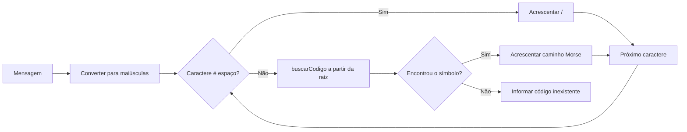
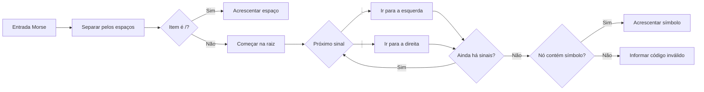

<div align="center">

# Morse-Tree

### Do texto ao sinal — e do sinal de volta ao texto.

Uma aplicação de console em **Java** que transforma o código Morse em uma árvore binária interativa.


</div>

> **A ideia em uma frase:** cada ponto segue para a esquerda, cada traço segue para a direita — e cada caminho identifica uma letra ou um número.

## 🧭 Navegação

- [O projeto](#-o-projeto)
- [Comece a usar](#-comece-a-usar)
- [Entenda a árvore](#-entenda-a-árvore)
- [Codificação e decodificação](#-codificação-e-decodificação)
- [Classes e funções](#-classes-e-funções)
- [Experimente e teste](#-experimente-e-teste)
- [Limitações conhecidas](#-limitações-conhecidas)

## 💡 O projeto

O Morse-Tree é um trabalho didático sobre **árvores binárias**, recursão e manipulação de texto. A aplicação constrói uma árvore com códigos Morse de letras e algarismos e oferece um menu para:

| | Você pode... |
|---|---|
| ✍️ | Codificar uma mensagem digitada |
| 📡 | Decodificar uma sequência Morse |
| 📄 | Codificar o conteúdo de um arquivo `.txt` |
| 📥 | Decodificar Morse armazenado em arquivo |
| 🌳 | Visualizar a árvore no console |

### Organização do código

```text
Main.java       Menu, entrada do usuário e leitura de arquivos
MorseTree.java  Construção e operações sobre a árvore Morse
MorseNode.java  Nó com símbolo, filho esquerdo e filho direito
```

A árvore é criada uma vez quando o programa inicia e permanece disponível durante toda a interação.

## 🚀 Comece a usar

Você precisa do **JDK** instalado. Abra um terminal na pasta do projeto e compile:

```bash
javac Main.java MorseTree.java MorseNode.java
```

Execute a aplicação:

```bash
java Main
```

O menu é exibido no terminal:

```text
======== MENU ========
1 - Codificar texto digitado
2 - Decodificar Morse digitado
3 - Codificar arquivo de texto
4 - Decodificar arquivo Morse
5 - Mostrar árvore
0 - Encerrar
```

> **Dica:** para as opções de arquivo, informe um caminho relativo à pasta atual ou um caminho completo. O programa lê todas as linhas e as reúne com espaços.

## 🌳 Entenda a árvore

Cada `MorseNode` guarda até três informações:

| Campo | O que representa |
|---|---|
| `simbolo` | A letra ou o algarismo naquele nó. `'\0'` significa que o nó é apenas uma passagem. |
| `esquerda` | Próximo nó quando o código contém `.` (**ponto**). |
| `direita` | Próximo nó quando o código contém `-` (**traço**). |

A **raiz** é o início do percurso. Para localizar um símbolo, leia o código Morse da esquerda para a direita e siga uma aresta por sinal:

```text
                           Raiz
                    .  ↙         ↘  -
                     E             T
                . ↙   ↘ -      . ↙   ↘ -
                 I       A       N       M
```

### Um percurso passo a passo: `...` → `S`

```text
Início na raiz
   └─ "." → esquerda
        └─ "." → esquerda
             └─ "." → esquerda → S
```

O caminho completo da raiz até o nó de `S` é `...`. Nós sem símbolo próprio continuam importantes: podem ser o início do caminho de códigos mais longos.

### Tabela de referência Morse

Os códigos abaixo são o padrão esperado para letras e números. Há uma divergência específica na implementação para `K` e `R`, explicada em [Limitações conhecidas](#-limitações-conhecidas).

| Letra | Código | Letra | Código | Número | Código |
|:---:|:---:|:---:|:---:|:---:|:---:|
| A | `.-` | N | `-.` | 0 | `-----` |
| B | `-...` | O | `---` | 1 | `.----` |
| C | `-.-.` | P | `.--.` | 2 | `..---` |
| D | `-..` | Q | `--.-` | 3 | `...--` |
| E | `.` | R | `.-.` | 4 | `....-` |
| F | `..-.` | S | `...` | 5 | `.....` |
| G | `--.` | T | `-` | 6 | `-....` |
| H | `....` | U | `..-` | 7 | `--...` |
| I | `..` | V | `...-` | 8 | `---..` |
| J | `.---` | W | `.--` | 9 | `----.` |
| K | `-.-` | X | `-..-` | | |
| L | `.-..` | Y | `-.--` | | |
| M | `--` | Z | `--..` | | |

## 🔄 Codificação e decodificação

O espaço entre códigos separa **símbolos**. A barra `/` representa um espaço entre **palavras**.

```text
TEXTO:  SOS
MORSE:  ... --- ...

TEXTO:  OI TUDO BEM
MORSE:  --- .. / - ..- -.. --- / -... . --
```

### Como o texto vira Morse

`codificar(String mensagem)` trabalha caractere por caractere:



Para cada letra, `buscarCodigo` explora a árvore recursivamente: tenta primeiro a esquerda (`.`) e depois a direita (`-`). O caminho acumulado é o código da letra. Os códigos encontrados são unidos por espaços.

**Exemplo com `S`:**

| Busca | Caminho acumulado |
|---|---|
| Começa na raiz | *(vazio)* |
| Segue à esquerda | `.` |
| Segue à esquerda novamente | `..` |
| Encontra `S` | `...` |

### Como o Morse vira texto

`decodificar(String codigo)` divide a entrada pelos espaços entre códigos e percorre cada código a partir da raiz:



Cada ponto move para a esquerda; cada traço move para a direita. Ao terminar o percurso, o símbolo do nó é acrescentado à mensagem. Um `/` acrescenta um espaço entre palavras.

> ⚠️ Se um item for inválido, a aplicação informa o problema e continua tentando decodificar os próximos itens. O resultado pode, portanto, conter os símbolos válidos que conseguiu ler.

## 🧩 Classes e funções

<details>
<summary><strong>MorseTree</strong> — construção e operações da árvore</summary>

| Função | Visibilidade | Responsabilidade |
|---|---|---|
| `MorseTree()` | Pública | Cria a raiz e constrói a árvore inicial. |
| `construirArvore()` | Privada | Insere os códigos cadastrados para letras e algarismos. |
| `inserir(String codigo, char simbolo)` | Pública | Percorre o código e guarda o símbolo no nó final, criando os nós necessários. |
| `buscarCodigo(MorseNode no, char simbolo, String caminho)` | Pública | Busca recursivamente um símbolo e devolve seu caminho, ou `null` se não existir. |
| `codificar(String mensagem)` | Pública | Converte texto em códigos separados por espaços; usa `/` entre palavras. |
| `decodificar(String codigo)` | Pública | Converte códigos Morse em texto e interpreta `/` como espaço. |
| `mostrarArvore()` | Pública | Inicia a impressão da árvore no console. |
| `mostrarArvore(MorseNode no, String caminho, boolean ultimo, String direcao)` | Privada | Percorre os nós recursivamente e formata os ramos exibidos. |

</details>

<details>
<summary><strong>Main</strong> — interação com a pessoa usuária</summary>

| Função | Responsabilidade |
|---|---|
| `main(String[] args)` | Cria a árvore, apresenta o menu e encaminha cada opção para a operação correspondente. |
| `codificarArquivo(MorseTree arvore, Scanner entrada)` | Lê um arquivo de texto e envia seu conteúdo para codificação. |

Na leitura de arquivos, `Main` também reúne as linhas antes de chamar a codificação ou a decodificação e trata erros de leitura, como arquivo não encontrado.

</details>

<details>
<summary><strong>MorseNode</strong> — unidade básica da árvore</summary>

Cada nó possui o campo `simbolo` e as referências `esquerda` e `direita`. O construtor cria um nó sem filhos; os ramos são ligados durante a inserção dos códigos.

</details>

## 🧪 Experimente e teste

O repositório **não possui testes automatizados**. Faça uma validação manual pelo menu:

| O que testar | Entrada | Resultado esperado |
|---|---|---|
| Codificar | `SOS` | `... --- ...` |
| Decodificar | `... --- ...` | `SOS` |
| Codificar palavras | `OI TUDO BEM` | `--- .. / - ..- -.. --- / -... . --` |
| Decodificar palavras | `--- .. / - ..- -.. --- / -... . --` | `OI TUDO BEM` |
| Visualizar | Opção `5` | Ramos marcados com `.` à esquerda e `-` à direita |

Também há dois arquivos de exemplo:

| Arquivo | Conteúdo | Use a opção |
|---|---|:---:|
| `testeMorse1.txt` | Morse para `TESTE MORSE` | `4` |
| `testeMorse2.txt` | Texto `OI TUDO BEM` | `3` |

Para experimentar a leitura de arquivo, informe o nome ou caminho do arquivo quando solicitado. Para compilar e iniciar novamente:

```bash
javac Main.java MorseTree.java MorseNode.java
java Main
```

## ⚠️ Limitações conhecidas

- O programa aceita letras sem acento e algarismos; pontuação, letras acentuadas e outros caracteres não estão cadastrados.
- Na implementação atual, `K` e `R` são inseridos ambos com o código `-.-`. Como ocupam o mesmo nó, a inserção de `R` sobrescreve `K`: `K` não pode ser codificado nem decodificado e `R` usa um código diferente do Morse convencional (`.-.`).
- Se a codificação encontrar um caractere não suportado, imprime `Código inexistente` e devolve uma string vazia.
- Na decodificação, códigos inválidos são informados no console; os símbolos válidos restantes ainda podem ser devolvidos.
- O menu espera que a opção digitada seja numérica.

---

<div align="center">

Feito para explorar **Java**, **recursão** e **árvores binárias** — um ponto e um traço por vez.

</div>
